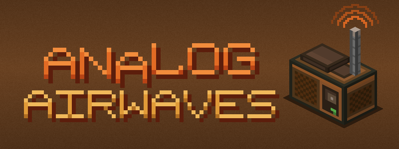

  

A small NeoForge 1.21.1 radio-station extension for [Analog Audio](https://modrinth.com/mod/analog-audio), adding broadcast transmitters and portable radios.

Place a radio broadcaster directly on top of an Analog Audio radio, tune it to a frequency, then tune a portable radio to the same frequency to listen to your radio station!!

## What's up

- **Radio Broadcasters** broadcast the radio beneath them across the dimension by default (Can be changed to universal inlcuding modded dimensions in the config). They **only** broadcast while their chunk is loaded.
- **Portable radios** play music while held, or while placed and powered on.
- Placed radios use the station's own broadcast volume
- Multiple loaded radio broadcasters on the same frequency cause interference, and receivers on that frequency hear static instead of a station.
- **Create mod integration** When create mod is installed seperate create specific recipes will be used.

Todo: Create recipes, Seperate radio block volume from portable radio volume.

 Requires [Analog Audio 0.1.5-hotfix.1](https://modrinth.com/mod/analog-audio/version/BshMjyFt).
 Recommended [Create Power Loader](https://modrinth.com/mod/create-power-loader) or [Chunk Loaders](https://modrinth.com/mod/chunk-loaders).
